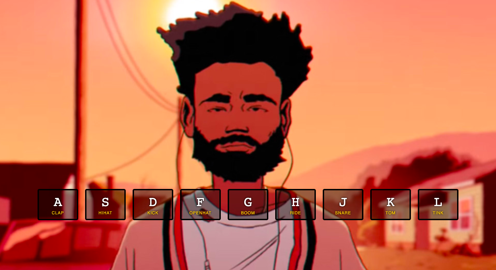

# javaScript30DayChallenge
30 day challenge to build small applications using vanilla JS. 

Completed Challenge 1

JS Drum Kit Set

Completed Challenge 2 

JS Clock

Completed Challenge 3

Blurred

Clear

CSS Variables - The inputs change the blur, background color and spacing. 

Completed Challenge 4

Array Cardio Sprint. Included reduce, map, filter and sort Array methods. 

Completed Challenge 5

FlexPanels

Completed Challenge 6

TypeAhead

